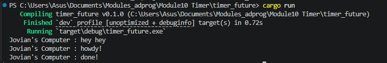
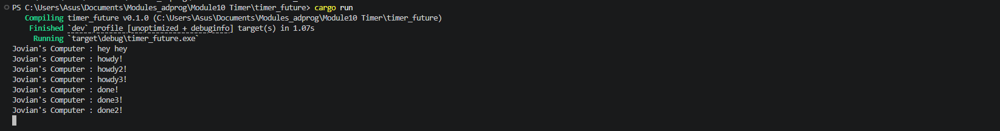
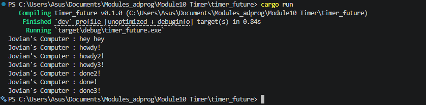

Screenshot hasil setelah execution pertama : 

Explanation : 
Setelah kita menjalankan program tersebut, kita dapat melihat bahwa "Jovian's Computer : hey hey" di print duluan sebelum yang lain karena berhubungan dengan konsep cara kerja asynchronous programming di Rust (lazy) dan cara kerja fungsi spawner.spawn yang tidak langsung mengeksekusi kode dalam blok async. Saat spawner.spawn dipanggil, fungsi tersebut hanya bertugas untuk membungkus blok async menjadi sebuah Task dan memasukannya ke dalam ready queue. Setelah tugas berhasil dimasukkan, fungsi spawn akan langsung selesai tanpa menunggu kode di dalamnya berjalan. Karena proses pengirimannya juga non blocking, main thread langsung menjalankan kode berikutnya secara berurutan sehingga 'Jovian's Computer : hey hey' dapat tercetak. Kode dalam blok async baru benar-benar jalan ketika fungsi executor.run() dipanggil.

Screenshot hasil multiple spawn tanpa drop spawner : 

Explanation : 
Dari hasil tersebut, kita dapat melihat 'hey hey' muncul paling awal diikuti oleh kumpulan howdy, terakhir ada kumpulan done dengan urutan acak. Kita juga dapat melihat program hang di akhir. Teks 'hey hey' muncul paling awal karena fungsi spawner.spawn hanya bertugas memasukkan task ke queue tanpa langsung eksekusinya. Setelah tugas dimasukkan, main thread langsung melanjutkan baris kode berikutnya untuk mencetak 'hey hey'. Begitu executor.run() dipanggil, ia mengambil ketiga tugas dari antrean secara berurutan dan melakukan polling pertama. Karena masing-masing task langsung bertemu dengan TimerFuture yang mengembalikan status Poll::Pending (harus menunggu selama 2 detik), ketiga tugas tersebut dihentikan sementara. Itulah mengapa semua teks "howdy" ("howdy!", "howdy2!", "howdy3!") tercetak bersamaan di awal sebelum ada satu pun tugas yang menyelesaikan masa tunggunya. Setelah jeda waktu 2 detik selesai, pesan penutup dari setiap tugas tercetak dengan urutan yang tidak berurutan, yaitu "done!", "done3!", baru kemudian "done2!". Hal ini terjadi karena setiap kali TimerFuture::new dipanggil, ia membuat sebuah thread baru di tingkat sistem operasi untuk menangani waktu sleep secara mandiri dan paralel. Karena penjadwalan thread oleh sistem operasi bersifat non-deterministik (acak), thread-thread tersebut selesai tidur dan memanggil waker.wake() pada waktu yang sangat tipis (selisih milidetik). Tugas yang thread-nya bangun lebih cepat akan masuk kembali ke antrean (ready_queue) terlebih dahulu, sehingga executor memproses ulang tugas tersebut dan mencetak kata "done" sesuai urutan kedatangan mereka kembali di antrean. Lalu program hang di akhir karena tidak adanya perintah drop.spawner yaitu untuk menghentikan spawner sehingga program tersebut menunggu tugas masuk.

Screenshot hasil multipler spawn dengan drop spawner : 

Explanation : 
Saat kita menambahkan drop spawner, penjelasan program sama seperti sebelumnya (tanpa drop spawner), hanya saja di akhir kita bisa melihat program kita berhenti karena perintah drop.spawner menutup spawner yang aktif menunggu tugas datang sehingga program langsung berhenti.